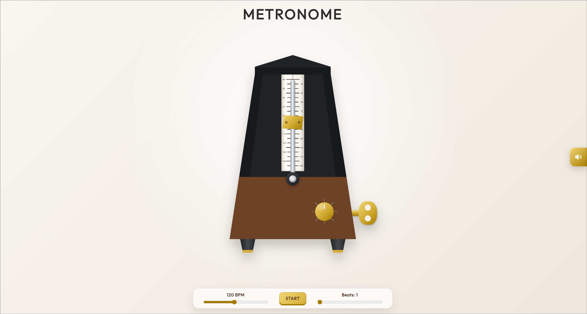
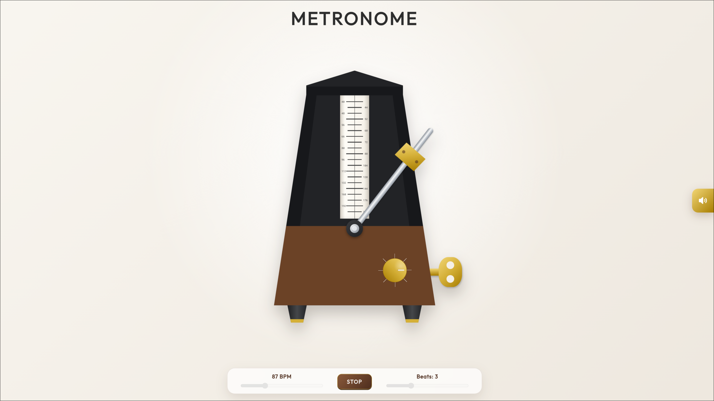
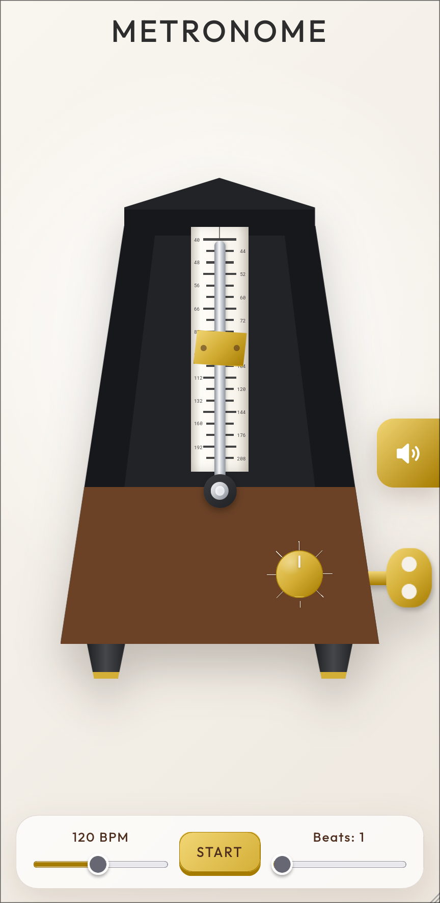
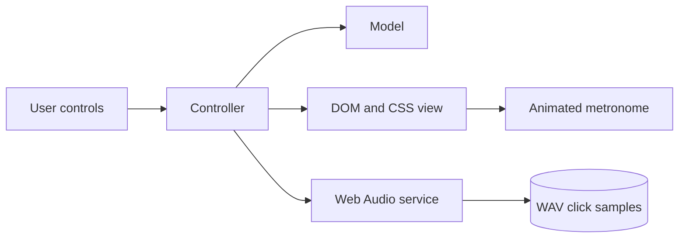

<div align="center">



# Metronome

**A responsive, browser-based mechanical metronome**

[](https://metronome-five-ruby.vercel.app/)
[](https://github.com/a-jadczak/metronome/actions/workflows/tests.yml?query=branch%3Amaster)
[](https://github.com/a-jadczak/metronome/commits)
[](https://github.com/a-jadczak/metronome)
[](https://github.com/a-jadczak/metronome)

</div>

## 📋 Table of Contents

- [🎯 Overview](#-overview)
  - [❓ Problem](#-problem)
  - [💡 Solution](#-solution)
- [✨ Features](#-features)
- [🚀 Demo](#-demo)
- [🖼️ Screenshots](#️-screenshots)
- [🛠️ Tech Stack](#️-tech-stack)
  - [⚖️ Technical Decisions](#️-technical-decisions)
- [🏗️ Architecture](#️-architecture)
- [🧩 Challenges](#-challenges)
- [🏁 Getting Started](#-getting-started)
- [📖 Usage](#-usage)
- [🧪 Testing](#-testing)
- [📁 Project Structure](#-project-structure)
- [📄 License](#-license)

## 🎯 Overview

### **Metronome is a single-page web application for practicing and improving your sense of rhythm and timing.**

It recreates the look and movement of a traditional mechanical metronome while providing the convenience of precise browser-based controls. Musicians can select a tempo, choose the number of beats in a measure, adjust the volume, and start practicing.

### ❓ Problem

Practicing rhythm requires a dependable pulse, but a physical metronome is not always available. A useful digital alternative must provide correct audible feedback.

### 💡 Solution

The application provides an accessible digital metronome that delivers a consistent audible pulse directly in the browser.

## ✨ Features

### Adjustable tempo

Set the pulse anywhere from **40 to 208 BPM**. The displayed BPM, pendulum speed, and sliding weight update together.

### Configurable measures

Choose **1 to 8 beats per measure**. The first beat uses a strong click and the remaining beats use a lighter click.

### Playback and volume controls

Start or stop playback and set the output volume from **0% to 100%**, including a visual muted state at zero.

### Mechanical animation

The pendulum, sliding weight, beat dial, and winding key respond to the active settings and playback state.

## 🚀 Demo

The application is available online:

### **[→ Open Live Demo](https://metronome-five-ruby.vercel.app/)**

> No installation or account is required to use the metronome.

## 🖼️ Screenshots

### Desktop

<p align="center">
  
</p>

### Mobile

<p align="center">
  
</p>

## 🛠️ Tech Stack

| Category     | Technologies                         |
| ------------ | ------------------------------------ |
| **Frontend** | `HTML5` · `CSS3` · `JavaScript ES6+` |
| **Audio**    | `Web Audio API`                      |
| **Testing**  | `Vitest` · `Playwright`              |
| **Tooling**  | `Vite`                               |

### ⚖️ Technical Decisions

<details>
<summary><strong>Why the Web Audio API?</strong></summary>

<br>

The Web Audio API allows click samples to be decoded in advance and played through a shared audio graph. This reduces the work required for each beat, avoids creating a new HTML audio element for every click, and provides direct gain control for the volume setting.

</details>

## 🏗️ Architecture

The application uses a small MVC-inspired structure with a separate audio service:



- The **model** stores tempo, beats, volume, and playback state.
- The **view** renders labels, mechanism positions, and animation state.
- The **controller** handles user input, beat sequencing, and playback transitions.
- The **audio service** loads and decodes the click samples, controls gain, and creates an audio source for each beat.

## 🧩 Challenges

### Keeping audio accurate at high BPM

One of the main challenges was keeping the click sound synchronized with the selected tempo. Using standard audio playback introduced noticeable delays at higher BPM values, where even small timing inconsistencies made the metronome feel inaccurate.

To reduce playback overhead, I replaced the original playback approach with the Web Audio API. The click samples are loaded and decoded in advance, then played through a shared audio graph when each beat is triggered. I also trimmed both samples to contain only the audio needed for each click.

### Creating a natural pendulum animation

The initial pendulum animation felt too rigid when changing direction at the edges of its swing. Another challenge appeared when stopping the metronome: the timing of the pendulum's return to the center did not match the timing of its regular swing, making the transition feel unnatural.

I refined the swing using custom cubic-bezier timing functions at different stages of the animation, creating more natural acceleration and deceleration around each turning point.

## 🏁 Getting Started

### 📋 Requirements

| Requirement | Version               |
| ----------- | --------------------- |
| Node.js     | `20.19+` or `22.12+`  |
| npm         | Included with Node.js |

### 📦 Installation

**1. Clone the repository**

```bash
git clone https://github.com/a-jadczak/metronome.git
```

**2. Enter the project directory**

```bash
cd metronome
```

**3. Install dependencies**

```bash
npm install
```

**4. Install Chromium for the browser tests**

```bash
npx playwright install chromium
```

### 💻 Development

Start the Vite development server:

```bash
npm run dev
```

Then open [http://127.0.0.1:5173](http://127.0.0.1:5173).

### 🏭 Production Build

Create an optimized production build:

```bash
npm run build
```

The output is written to `dist/`. Preview it locally with:

```bash
npm run preview
```

## 📖 Usage

1. Use the **tempo slider** to choose a value between 40 and 208 BPM.
2. Use the **beats slider** to choose the measure length.
3. Adjust the **volume slider** as needed.
4. Select **START** to begin playback.
5. Select **STOP** to finish. Playback ends immediately while the pendulum returns to center.

## 🧪 Testing

| Command                 | Purpose                                      |
| ----------------------- | -------------------------------------------- |
| `npm test`              | Run unit tests in watch mode                 |
| `npm run test:run`      | Run the unit suite once in headless Chromium |
| `npm run test:ui`       | Run unit tests in a visible browser          |
| `npm run test:coverage` | Generate a unit-test coverage report         |
| `npm run test:e2e`      | Run end-to-end tests in Chromium             |
| `npm run test:e2e:ui`   | Open Playwright's interactive test UI        |

## 📁 Project Structure

```text
metronome/
├── public/
│   ├── favicon.png
│   └── sounds/                 # Strong and light click samples
├── src/
│   ├── scripts/
│   │   ├── constant/           # Defaults, playback states, and tempo values
│   │   ├── dom/                # DOM element references
│   │   ├── metronome/          # Model, view, and controller
│   │   ├── services/           # Audio loading and playback
│   │   └── utils/              # Shared range utility
│   ├── styles/
│   │   ├── base/               # Variables and global rules
│   │   └── components/         # Controls and metronome mechanisms
│   └── main.js                 # Application entry point
├── tests/
│   ├── e2e/                    # Playwright user-flow tests
│   └── unit/                   # Vitest browser tests
├── index.html                  # Vite HTML entry point
├── playwright.config.js
├── vite.config.js
└── vitest.config.js
```

## 📄 License

This project is licensed under the [MIT License](./LICENSE).

<div align="center">

**[⬆ Back to top](#metronome)**

</div>
